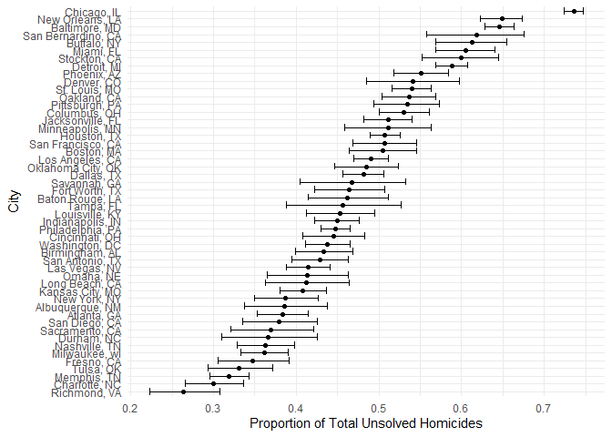
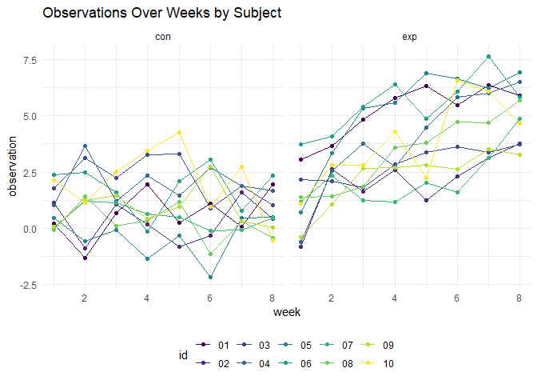
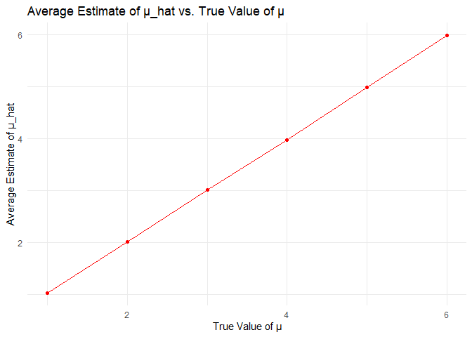
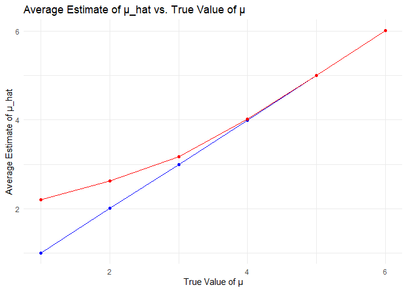

p8105_hw5_td2809
================
Chris Deng
2023-11-15

# Problem 1

Describe the raw data. Create a city_state variable (e.g. “Baltimore,
MD”) and then summarize within cities to obtain the total number of
homicides and the number of unsolved homicides (those for which the
disposition is “Closed without arrest” or “Open/No arrest”).

``` r
homicide_data =
  read_csv("data/homicide-data.csv", show_col_types = FALSE)
```

The raw data includes 52179 observations and 12 variables.

``` r
# create city_state variable and summarize within cities
homicides_summary = 
  homicide_data  |> 
  mutate(city_state = paste(city, state, sep = ", "))  |> 
  group_by(city_state) |> 
  summarise(
    total_homicides = n(),
    total_unsolved_homicides = sum(disposition %in% c("Closed without arrest", "Open/No arrest"))
  ) |> 
  filter(total_unsolved_homicides != 0)

homicides_summary |> 
  head(10) |> 
  knitr::kable()
```

| city_state      | total_homicides | total_unsolved_homicides |
|:----------------|----------------:|-------------------------:|
| Albuquerque, NM |             378 |                      146 |
| Atlanta, GA     |             973 |                      373 |
| Baltimore, MD   |            2827 |                     1825 |
| Baton Rouge, LA |             424 |                      196 |
| Birmingham, AL  |             800 |                      347 |
| Boston, MA      |             614 |                      310 |
| Buffalo, NY     |             521 |                      319 |
| Charlotte, NC   |             687 |                      206 |
| Chicago, IL     |            5535 |                     4073 |
| Cincinnati, OH  |             694 |                      309 |

For the city of Baltimore, MD, use the prop.test function to estimate
the proportion of homicides that are unsolved; save the output of
prop.test as an R object, apply the broom::tidy to this object and pull
the estimated proportion and confidence intervals from the resulting
tidy dataframe.

``` r
baltimore_data =
  homicides_summary  |> 
  filter(city_state == "Baltimore, MD") 

baltimore_unsolved = pull(baltimore_data, total_unsolved_homicides)
baltimore_total = pull(baltimore_data, total_homicides)
baltimore_test = prop.test(baltimore_unsolved, baltimore_total)

broom::tidy(baltimore_test)  |> 
  select(estimate, conf.low, conf.high)
```

    ## # A tibble: 1 × 3
    ##   estimate conf.low conf.high
    ##      <dbl>    <dbl>     <dbl>
    ## 1    0.646    0.628     0.663

Now run `prop.test` for each of the cities in your dataset, and extract
both the proportion of unsolved homicides and the confidence interval
for each. Do this within a “tidy” pipeline, making use of purrr::map,
purrr::map2, list columns and unnest as necessary to create a tidy
dataframe with estimated proportions and CIs for each city.

``` r
city_estimates = homicides_summary  |> 
  group_by(city_state)  |> 
  summarize(
    prop_test = list(prop.test(total_unsolved_homicides, total_homicides))
  )  |>  
  mutate(tidy_test = purrr::map(prop_test, broom::tidy))  |> 
  select(-prop_test)  |> 
  unnest(tidy_test)  |> 
  select(city_state, estimate, conf.low, conf.high) 
```

Create a plot that shows the estimates and CIs for each city – check out
geom_errorbar for a way to add error bars based on the upper and lower
limits. Organize cities according to the proportion of unsolved
homicides.

``` r
ggplot(city_estimates, aes(x = reorder(city_state, estimate), y = estimate)) +
  geom_point() +
  geom_errorbar(aes(ymin = conf.low, ymax = conf.high)) +
  coord_flip() +
  labs(x = "City", y = "Proportion of Total Unsolved Homicides")
```

<!-- -->

# Problem 2

Create a tidy dataframe containing data from all participants, including
the subject ID, arm, and observations over time

``` r
import_data = function(name, url_path = "data/problem2_data/") {
  read_csv(str_c(url_path, name), show_col_types = FALSE) 
}

files_df = 
  tibble(names = list.files("data/data_p2/")) |> 
  mutate(dat = map(names, ~import_data(.x, "data/data_p2/"))) |>
  unnest(dat) |> 
  mutate(names = str_remove(names, "\\.csv")) |> 
  separate(names, into = c("arm", "id"), sep = "_") |> 
  pivot_longer(
    cols = starts_with("week"),
    names_to = "week",
    values_to = "observation",
    names_prefix = "week_",
    names_transform = list(week = as.numeric)
  )

files_df |> 
  ggplot(aes(x = week, y = observation, group = id, color = id)) +
  geom_line() +
  geom_point() +
  facet_grid(. ~ arm) +
  labs(title = "Observations Over Weeks by Subject")
```

<!-- --> \#
Problem 3 Set $\mu$ = 0

``` r
# define parameters
n_simulations = 5000
n = 30
sigma = 5
mu = 0
alpha = 0.05

t_test = function(mu, n, sigma) {
  sample = rnorm(n, mean = mu, sd = sigma)
  test_result = t.test(sample, mu = 0, conf.level = 0.95)
  tidy_result = broom::tidy(test_result) |>
    rename(mu_hat = estimate, p_value = p.value)
  return(tidy_result[c("mu_hat", "p_value")])
}

simulation_results = map_dfr(1:n_simulations, ~t_test(mu, n, sigma))

head(simulation_results)
```

    ## # A tibble: 6 × 2
    ##     mu_hat p_value
    ##      <dbl>   <dbl>
    ## 1  0.655     0.496
    ## 2 -1.28      0.181
    ## 3  1.22      0.236
    ## 4  1.09      0.366
    ## 5  0.102     0.887
    ## 6  0.00869   0.994

``` r
mu_list = setNames(1:6, paste("mu =", 1:6))

# Run the simulation for each value of mu
results = map_df(mu_list, function(mu_value) {
  map_dfr(1:n_simulations, ~t_test(mu_value, n, sigma))
}, .id = "mu_label")

# Convert the mu_label to a numeric value for plotting
results = results |>
  mutate(mu = as.numeric(str_extract(mu_label, "\\d+")))
```

``` r
power_results = results |>
  group_by(mu) |>
  summarise(
    power = mean(p_value < alpha),
    mean_mu_hat = mean(mu_hat),
    mean_mu_rejected = mean(mu_hat[p_value < alpha], na.rm = TRUE)
  ) |>
  ungroup()

# Plotting
power_results |>
  ggplot(aes(x = mu, y = power)) +
  geom_point() +
  geom_line() +
  labs(title = "Power of Different µ", x = "µ", y = "Power")
```

<!-- --> \*
The plot shows that the power and effect size are positively
correlated.However, after reaching a certain level, the power
stabilizes, indicating that additional increases in effect size do not
significantly improve the power of the test.

``` r
power_results |>
  ggplot(aes(x = mu, y = mean_mu_hat)) +
  geom_point(color = "red") +
  geom_line(color = "red") +
  labs(title = "Average Estimate of µ_hat vs. True Value of µ", 
       x = "True Value of µ", 
       y = "Average Estimate of µ_hat")
```

<!-- -->

``` r
power_results |>
  ggplot(aes(x = mu)) +
  geom_point(aes(y = mean_mu_hat, group = 1), color = "blue") +
  geom_line(aes(y = mean_mu_hat, group = 1), color = "blue") +
  geom_point(aes(y = mean_mu_rejected, group = 1), color = "red") +
  geom_line(aes(y = mean_mu_rejected, group = 1), color = "red") +
  labs(
    title = "Average Estimate of µ_hat vs. True Value of µ", 
    x = "True Value of µ", 
    y = "Average Estimate of µ_hat"
  ) +
  scale_color_manual(
    labels = c("All", "Rejected"), 
    values = c("blue", "red")
  ) +
  theme(legend.title = element_blank())
```

<!-- -->
